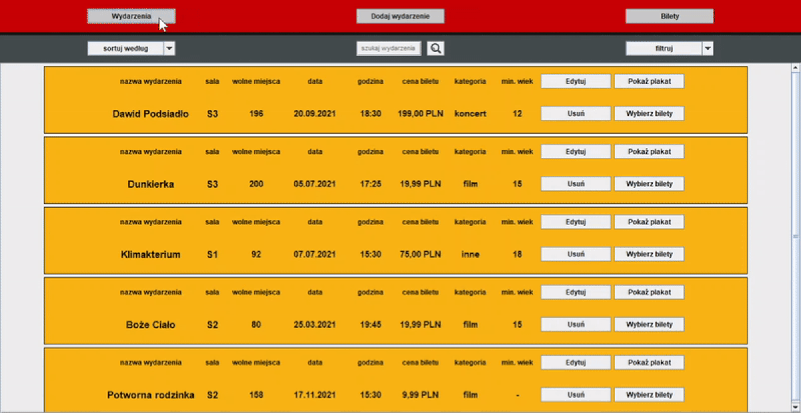
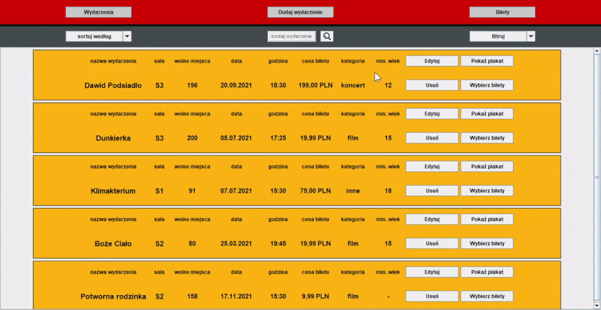
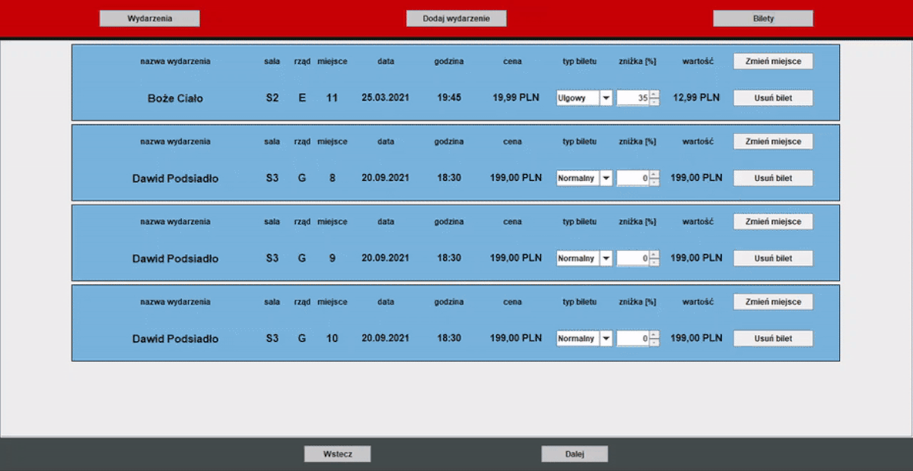

# Aplikacja do obsługi centrum kultury
Mój pierwszy rozbudowany projekt programistyczny napisany w języku Java. Aplikacja może być wykorzystywana przez pracowników do obsługi wszelakich instytucji kultury.
Aplikacja stworzona wraz z Kacprem Jabłońskim (Kacper - konfiguracja i obsługa bazy danych, Amadeusz - GUI oraz działanie aplikacji) w ramach projektu z przedmiotu Języki Programowania Wysokiego Poziomu w 4. semestrze studiów na kierunku Teleinformatyka (AGH, Kraków).

## Przegląd aplikacji
Aplikacja umożliwia dodawanie i zarządzanie wydarzeniami kulturalnymi oraz sprzedaż biletów w kinach, teatrach, domach kultury i innych tego typu instytucjach.
Poniżej przedstawiono funkcjonalności i działanie aplikacji.

#### Repertuar
 

Po uruchomieniu aplikacji wyświetla się panel główny z przyciskami **(Wydarzenia, Dodaj wydarzenie, Bilety)** oraz panel zawierający wszystkie wydarzenia. 
Panel z wydarzeniami pozwala sortować oraz filtrować wydarzenia według różnych kryteriów, a także wyszukiwać konkretne wydarzenia po nazwie.
Ponadto możemy edytować lub usunąć dane wydarzenie, a także wyświetlić plakat.

#### Dodawanie nowego wydarzenia

Po kliknięciu przycisku **Dodaj wydarzenie** pojawia się formularz nowego wydarzenia.
Zawiera on nazwę, datę, godzinę, typ, opis i plakat wydarzenia a także cenę biletu, minimalny wiek widza oraz numer sali i jej obłożenie (ze względu na powstawanie aplikacji w czasach pandemii).
Wszystkie pola oprócz opisu i plakatu są wymagane. Po uzupełnieniu formularza klikamy **Potwierdź**.

#### Wybór miejsc i edycja biletów

Klikając przycisk **Wybierz bilety** możemy wybrać miejsca wprost z planu sali.
Miejsca zaznaczone na czerwono to miejsca sprzedane, niebieskie - wolne, a zielone to te, które są już wybrane dla aktualnej transakcji.
Po kliknięciu w dane miejsce, natychmiast pojawia się ono w sekcji **Bilety**.

#### Finalizacja transakcji

Po wybraniu biletów pozostaje ostatni krok aby sfinalizować transakcję - należy wybrać typ potwierdzenia zakupu oraz formę płatności.
Klient ma do wyboru odpowiednio paragon lub fakturę VAT oraz płatność gotówką lub kartą.
W obu przypadkach zaznaczenie jednej z dwóch opcji jest wymagane do zakończenia transakcji.

## Uruchomienie aplikacji
* Pobierz zawartość repozytorium
* Zaimportuj projekt do IntelliJ lub innego środowiska obsługującego Java
* Zainstaluj [AMPPS](https://ampps.com/downloads/) (lub inny pakiet zawierający bazę danych MySQL)
* Uruchom interfejs bazy danych phpMyAdmin i zaloguj się
	- login: root
	- hasło: mysql
* Utwórz nową bazę danych o nazwie **projekt** i zaimportuj zrzut bazy dostępny w repozytorium
* W klasie AplikacjaGUI.java uruchom metodę main
